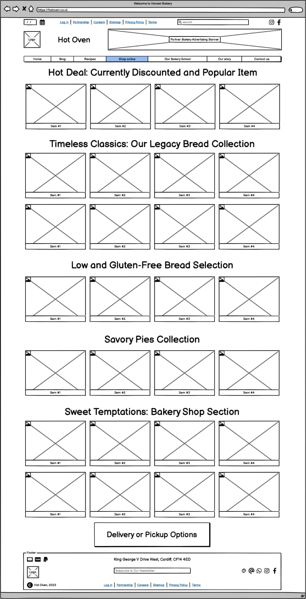
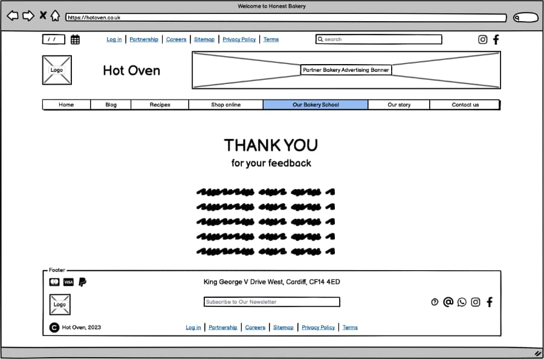
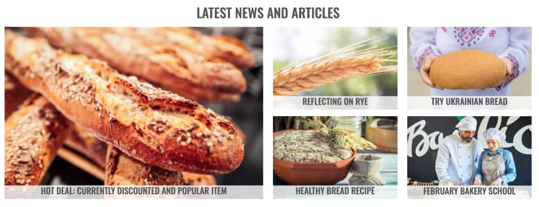
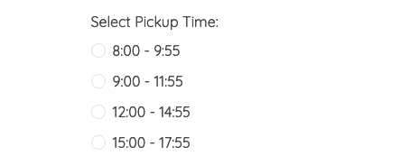
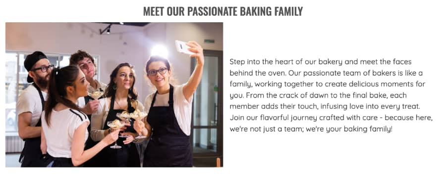
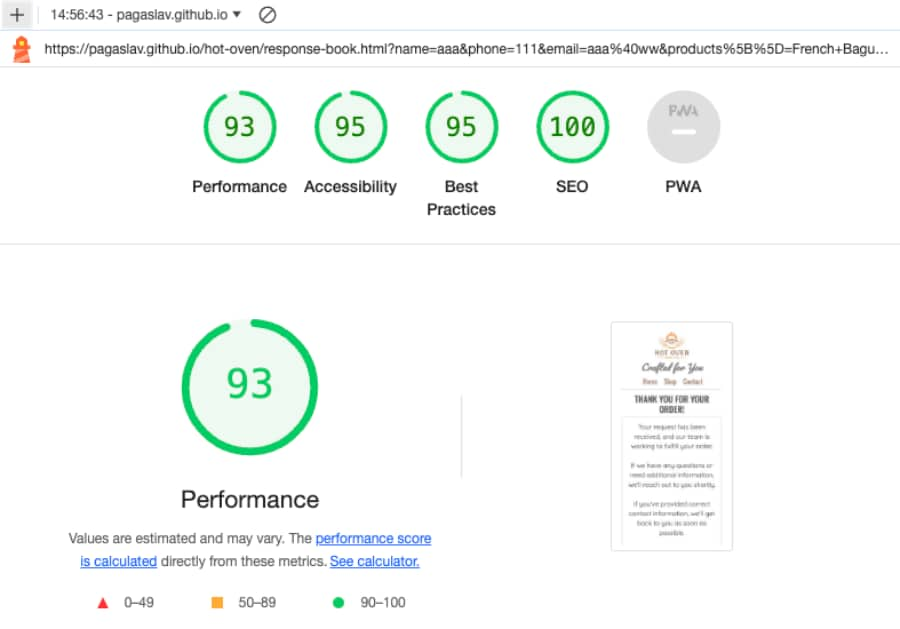
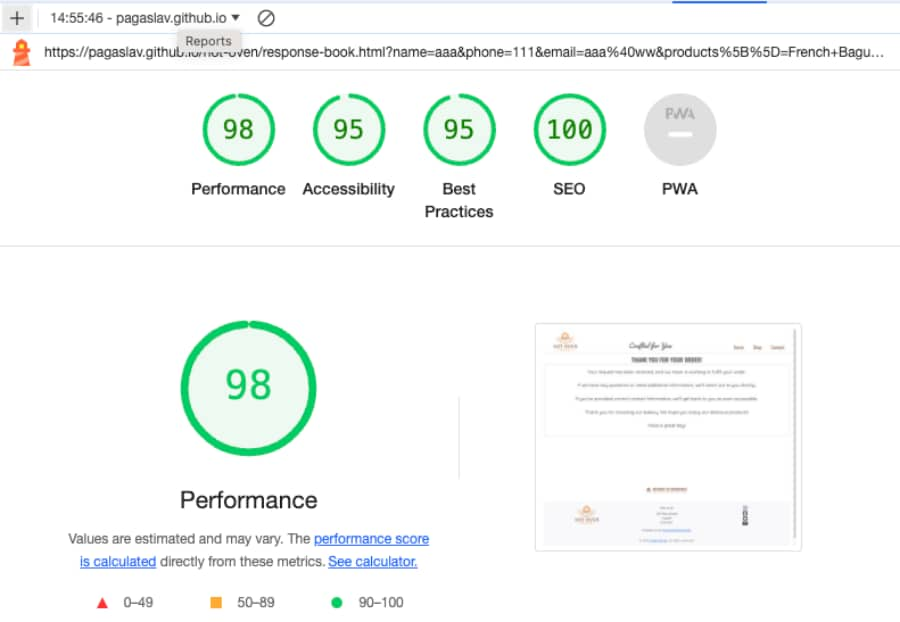
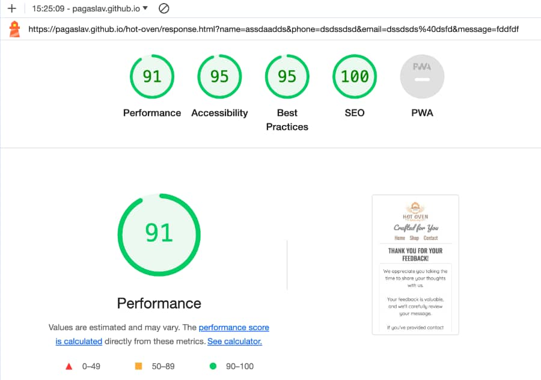

# Hot Oven README

View the live site [here](https://pagaslav.github.io/hot-oven)

## Introduction

The **Hot Oven Bakery** website provides information about our range of baked goods, including French baguettes, sourdough, sweet baked goods and gluten-free options. You can easily place orders online, choose flexible pickup times, and contact us for inquiries or feedback. Our goal is to offer a straightforward and convenient experience, making artisanal baking accessible to everyone.
--

## **Project Goals**

The Hot Oven Bakery website aims to offer a seamless and enjoyable experience for users interested in our artisanal baked goods. Key goals include:

1. **Effortless Online Ordering:** Create a user-friendly platform for convenient online ordering of a variety of baked products, from French baguettes to gluten-free options.
2. **Flexible Pickup Options:** Provide users with the flexibility to choose pickup times that suit their schedule, ensuring a hassle-free experience.
3. **Inquiry and Feedback:** Enable quick and easy communication for users to inquire about products, place custom orders, or share feedback, fostering a direct connection between the bakery and its customers.
4. **Accessible Information:** Offer detailed information about each product, including ingredients and nutritional details, to help customers make informed choices.
5. **Rich Content Hub:** Showcase engaging articles and recipes to share the passion for baking, providing valuable insights and tips to both enthusiasts and aspiring bakers.
6. **Bakery School Schedule:** Feature a schedule for our bakery school, allowing users to explore and sign up for classes, further enhancing their baking skills.

By achieving these goals, Hot Oven Bakery strives to make high-quality, freshly baked goods easily accessible while maintaining a personalized and engaging interaction with its customers.

--

## **User Stories**

### **First Time Visitor Goals:**

1. As a first-time visitor, I want to easily grasp the purpose of the Hot Oven Bakery website, allowing me to understand more about the bakery and its offerings.
2. As a first-time visitor, I aim to navigate effortlessly through the website, ensuring a smooth and intuitive browsing experience to find the desired content.
3. As a first-time visitor, I look forward to reading testimonials to gauge the trustworthiness of Hot Oven Bakery and the quality of its baked goods.

### **Returning Visitor Goals:**

1. As a returning visitor, I intend to explore a variety of baked products offered by Hot Oven Bakery, making it easier for me to make a selection.
2. As a returning visitor, I want detailed information about each baked good, helping me learn about the ingredients and characteristics to make an informed decision.
3. As a returning visitor, I seek accessible contact options to connect with the bakery, enabling me to ask questions or make specific requests regarding baked goods.
4. As a returning user, my objective is to explore the schedule of classes at Hot Oven Bakery, contemplating enrolment in baking courses for an in-depth learning experience and community engagement.
5. As a returning visitor, I aim to discover community links that provide additional insights into Hot Oven Bakery, fostering a sense of community and connection.

### **Frequent Visitor Goals:**

1. As a frequent user, I wish to quickly check for any updates or changes in the available baked goods, "hot" deals, helping me decide which delightful treat to order.
2. As a frequent user, I desire diverse contact options, allowing me to choose the most suitable way to get a prompt and explicit response to my inquiries or feedback.
3. As a frequent user, I return to the website periodically with the intention of discovering new recipes and articles, as well as staying informed about the upcoming schedule of classes for the next month.
--

## User Experience (UX) & User Interface (UI)

### Wireframes

- Home Page
    
    
    
- Page with article about RYE
    
    
    
- Page about Ukrainian bread
    
    
    
- Page about healthy bread
    
    
    
- Page with the schedule of the baking school
    
    
    
- Shop page
    
    
    
- Order and Collect form page
    
    
    
- Response page #1
    
    
    
- Contact page
    
    
    
- Response page #2
    
    
    
- Map of website
    
    
    

### Colour Scheme

#### Color Palette

- **Background:** #FFFFFF (White)
- **Menu Items, Return Links, and Buttons:** #a68370 (Beaver)
- **Hover State for Menu Items, Return Links, and Buttons:** #f9a55a (Sandy brown)
- **Footer Background:** #f8f9fa (Seasalt)
    
    
    

#### Color Psychology

The color palette of Hot Oven Bakery is thoughtfully crafted to evoke specific emotions and create a visually appealing experience for visitors.

- **White Background:** The use of a white background represents purity and cleanliness, aligning with the fresh and wholesome nature of our bakery products.
- **#a68370 (Warm Brown) for Menu Items, Return Links, and Buttons:** The warm brown color conveys a sense of comfort and reliability, inviting visitors to explore our offerings and engage with our website.
- **#f9a55a (Golden-Brown) on Hover:** The golden-brown hover effect injects energy and warmth, encouraging interaction and drawing attention to key elements when users interact with them.
- **#f8f9fa (Light Blue) for Footer Background:** The light blue footer background provides a soft and calming conclusion to the website, leaving a positive and lasting impression.

#### Accent Color

- **#f9a55a (Golden-Brown):** This accent color is strategically employed to highlight key elements, adding vibrancy and creating a memorable visual impact.

This carefully curated color scheme reflects the essence of Hot Oven Bakery, marrying warmth with sophistication, inviting users to explore and savor the delightful offerings on our platform.

### Typography

#### Main Font - Oswald

- **Typeface:** Oswald, sans-serif
- **Usage:** Oswald is utilised for menu items, return links, all headings, and prominent textual elements throughout the website. Its clean and modern design enhances readability and maintains a cohesive look across different sections.

#### Accent Font - Pacifico

- **Typeface:** Pacifico, cursive
- **Usage:** Pacifico is exclusively reserved for the slogan, adding a touch of personality and creativity to the phrase "Crafted for You." This font choice aims to create a memorable impression and emphasize the unique character of our bakery.

#### Body Text Font - Quicksand

- **Typeface:** Quicksand, sans-serif
- **Usage:** Quicksand is employed for the main body text in articles and descriptions. With its balanced and versatile style, Quicksand ensures a comfortable reading experience, promoting clarity and engagement with the content.

The combination of Oswald, Pacifico, and Quicksand contributes to a harmonious and visually appealing typographic hierarchy on the Hot Oven Bakery website. This thoughtful selection aims to enhance the overall user experience, making information easily accessible and reinforcing the brand's identity.

### Hot Oven Logo

Our logo embodies the essence of Hot Oven Bakery, capturing the artistry and warmth of our craft. A depiction of an oven cradling a perfectly baked loaf of bread takes center stage. The gentle hues of warm browns and light tans evoke the delicious golden-brown crust of impeccably prepared bread, adorned with two wheat stalks symbolising the quality of our ingredients.

The careful detailing extends to the edges, where a subtle touch of charred perfection adds character and visual appeal. This emblem not only represents our commitment to exquisite baking but also invites you to experience the art and flavour we infuse into every creation.

--

## **Features**

### **Navigation**

The navigation on the Hot Oven Bakery website is meticulously designed to provide a seamless and visually appealing user experience. Here's an overview of the navigation elements:

#### Navbar

##### Desktop View:

- Positioned at the top of the page.
- Logo and Slogan: The company logo is showcased on the left side, complemented by the slogan "Crafted for You" centred in the middle. If you click on the logo, you'll be directed to the home page or, if you're already there, the page will be refreshed.
- Navigation Links: Aligned on the right side, offering easy access to essential sections:
    - **HOME:** Leads to the home page, inviting users to explore the world of Hot Oven Bakery.
    - **SHOP:** Takes users to the shop page, presenting a delightful array of tempting bakery items.
    - **CONTACT:** Directs users to the contact form page, facilitating seamless communication with the bakery.

**Desktop Navbar Image:**

##### Responsive Design:

**Tablet View:**

- The navigation adapts for tablet devices, ensuring a user-friendly layout.
- Logo, slogan, and links are centred, providing a balanced and aesthetically pleasing appearance.
- Logo, slogan and links are split into three lines for better visibility.

**Tablet Navbar Image:**

**Mobile View:**

- On mobile devices, the navigation bar features the logo and centered slogan.
- Logo, slogan, and links are centred, providing a balanced and aesthetically pleasing appearance.
- Logo, slogan and links are split into three lines for better visibility.

**Mobile Navbar Image:**

**I chose not to make the navigation fixed due to my design preferences. Instead, at the bottom of each page, there is an option to either return to the homepage or to the top of the current page (home page, shop page and contact page). Additionally, each footer includes a clickable logo; clicking on it will take you back to the beginning of the home page.**

### Footer

- **Logo**. If you click on the logo, you'll be directed to the home page or, if you're already there, the page will be refreshed.
- **Address**: Hot Oven Bakery, 123 Main Street, Cardiff, CF10 2FY
- **Email**: [hot.oven@gmail.com](mailto:hot.oven@gmail.com)
- **Copyright**: 2024 [Artem Bryzh](https://www.linkedin.com/in/artem-bryzh-43109a176/). All rights reserved.

Connect with us on social media and stay updated on our latest offerings:

- **Instagram**: [Follow us in ](https://instagram.com/)
- **Facebook**: [Like our page](https://facebook.com/)
- **Twitter**: [Tweet with us](https://twitter.com/)
- **YouTube**: [Subscribe to our channel](https://youtube.com/)

#### Responsive Design:

**Tablet and Mobile View:**

- The footer adapts for tablet and mobile devices, ensuring a user-friendly layout.
- All information are centred, providing a balanced and aesthetically pleasing appearance.

### Home page

The home page provides users with a comprehensive overview of the bakery's activities. It offers access to the latest articles featuring recipes, the upcoming schedule of baking classes, and videos showcasing the bread-baking process. The page is responsive on all common screen sizes.

#### Latest News and Articles Section

Discover our featured articles that delve into the artistry of baking and the world of delicious treats:

- **Hot Deal: Currently Discounted and Popular Item**
Explore our bakery shop and seize the opportunity to indulge in our currently discounted and popular item.
- **Reflecting on Rye**
Immerse yourself in the fascinating journey of crafting bread with a focus on the unique qualities of rye.
- **Try Ukrainian Bread**
Embark on a cultural exploration through the delightful taste of Ukrainian bread, celebrating tradition and flavor.
- **Healthy Bread Recipe**
Discover the secrets behind a wholesome and nutritious bread recipe that perfectly balances health and taste.
- **February Bakery School**
Check out the schedule for our Bakery School in February 2024 and join us for a hands-on baking experience.
    
    
    

#### Behind the Scenes: How We Make Our Bread

Watch a sneak peek into our bakery with this captivating video on [YouTube](https://www.youtube.com/embed/dSnR7x6b4cc?si=6ZykH9BplB3k5VPI):

### Page with article about RYE

The "Reflecting on Rye" page provides an exploration of the historical, culinary, and nutritional aspects of rye grain. It covers the origins of rye from ancient Turkish soils to its prevalence in Northern Europe, emphasising its hardy nature. The page underscores rye's culinary versatility, nutritional benefits, and sustainable role in agriculture, offering a brief recipe for a simple rye bread as a practical application. Overall, it serves as an informative platform connecting users to the multifaceted characteristics of rye. 

Following the recipe, there is an enticing image of Ukrainian bread with rye, accompanied by a clickable "Order and Collect" button. Users can click the button to seamlessly transition to the bakery's product order form. Additionally, a link to return to the homepage is available, providing users with the opportunity to explore other articles or view videos about the baking process.

The page is responsive on all common screen sizes.

### Page about Ukrainian bread

"TRY UKRAINIAN BREAD" page offers insights into the cultural and culinary importance of Ukrainian rye bread, known as "zytniy." Crafted from locally sourced rye flour, the bread features prominently in traditional Ukrainian snacks and dishes. The page includes a straightforward recipe for users to replicate Ukrainian rye bread at home.

Following the recipe, there is an enticing image of Ukrainian bread with rye, accompanied by a clickable "Order and Collect" button. Users can click the button to seamlessly transition to the bakery's product order form. Additionally, a link to return to the homepage is available, providing users with the opportunity to explore other articles or view videos about the baking process.

The page is responsive on all common screen sizes.

### Page about healthy bread

This text elucidates the reasons for choosing gluten-free bread, especially for individuals prone to discomfort or allergies associated with gluten consumption. It underscores the positive impacts of adopting a gluten-free diet, encompassing enhanced well-being, digestive advantages, and potential mitigation of health risks.

Following the recipe, there is an enticing image of Gluten-free bread with flax, sunflower, and pumpkin seeds, accompanied by a clickable "Order and Collect" button. Users can click the button to seamlessly transition to the bakery's product order form. Additionally, a link to return to the homepage is available, providing users with the opportunity to explore other articles or view videos about the baking process.

The page is responsive on all common screen sizes.

### Page with the schedule of the baking school

The page provides information on the upcoming baking classes at Hot Oven Bakery. Held every Wednesday and Saturday, the classes cover a range of topics, including mastering sourdough, artisan bread shaping, sweet breads like cinnamon rolls, and advanced techniques such as enriched doughs. The schedule also includes a session on gluten-free baking, offering delicious options for all participants. 

All the information is presented in the form of a table for greater user convenience.

Users can access the bakery's homepage through the provided link for more information.

The page is responsive on all common screen sizes.

### Shop page

The Shop page on the Hot Oven Bakery website serves as a comprehensive display of our diverse product offerings, featuring an assortment of freshly baked artisanal bread, pastries, cakes, and cookies. Structured to provide an optimal user experience, this page encompasses distinct sections, each catering to specific product categories.

The Shop page is meticulously designed to align with Hot Oven Bakery's commitment to quality and variety. Each product's presentation is enhanced by a direct link to the baking order form, simplifying the user's journey and encouraging them to explore, order, and indulge in our freshly baked goods. The page is responsive on all common screen sizes.

#### Golden Crunch Experience:
This section highlights our flagship product, the French Baguette, accentuating its artisanal craftsmanship and unique crunch. To optimize design and enhance user engagement, an enticing text is strategically placed to the right of the prominent image. Instead of a conventional button, the image itself is made clickable. Upon clicking, users are seamlessly directed to the baking order form. Notably, the order form prioritizes French Baguettes, positioning them as the first item on the list. This design approach aims to captivate users visually, driving them towards the desired action of placing an order for our featured product, the French Baguette.

#### Timeless Classics: Our Legacy Bread Collection:
Highlighting the core bread offerings, including the Classic White Sourdough Bread, Toast Bread, and Ciabatta, this section ensures that users can make informed decisions. Each product is complemented by a convenient "Order and Collect" button, which is animated on hover, directly linking to the baking order form, streamlining the user journey.

#### Low and Gluten-Free Bread Selection:
Catering to health-conscious consumers, this section not only showcases our Low and Gluten-Free Bread Selection but also provides detailed descriptions and visually appealing imagery. To encourage seamless transactions, each product, such as the Gluten-Free Bread and Ukrainian Original Rye Bread, is accompanied by an intuitive "Order and Collect" button, which is animated on hover, guiding users to the baking order form.

#### Sweet Temptations: Bakery Shop Section:
Dedicated to sweet treats, this segment introduces the bakery shop's offerings with an emphasis on user engagement. Each product, including Apple Crumble, Sweet Brioche, Pumpkin Bread, and Daily Muffin, features an enticing description along with a "Order and Collect" button, which is animated on hover, ensuring a direct link to the baking order form for a hassle-free ordering process.

#### How We Sell Our Bread - Video:
Featuring an embedded video, this section provides users with a visual insight into the bakery's operations, specifically how our bread is presented and sold. The video is aimed at engaging bakery enthusiasts and fostering a connection with the brand.

The Shop page is intricately designed to adhere to Hot Oven Bakery's steadfast dedication to quality and diversity. Users can navigate through distinct sections, each curated with a specific quantity of products. This intentional design decision guarantees the prominence of each product, preventing them from becoming lost within the assortment. This meticulous approach aims to improve the overall User Experience (UX) by highlighting each product individually. The distinctive design element encourages users to delve into product details, take advantage of exclusive discounts, and make well-informed decisions, thereby fostering an interactive shopping experience.

### Order and Collect form page

The "Order and Collect" form page comprises a form where users are required to provide their information, select the bakery products they wish to purchase, and specify the preferred pickup time. The page is responsive on all common screen sizes. Logically, the form is divided into four sections. 

#### Customer Information section

The section where the user needs to provide personal information includes fields for Name, optional Phone Number, and Email.

- All text input fields are customised.
- Labels are animated when the input field is in focus and are not empty.
- All inputs, except the Phone number, are set to be required to fill out.
    

#### Product Selection and Quantity section

This section features the current bakery products available. Users can select the types of baked goods they are interested in and specify the quantity for each. This is a flexible component of the form that should adapt based on the bakery's current inventory.

- Each product is presented with its name and an adjacent checkbox.
- The quantity for each product is limited, and the user cannot select more than the specified quantity indicated in parentheses next to each item.
    

    
#### Select Pickup Time section

The section allows users to select a preferred time slot for collecting their orders. The section incorporates radio buttons, allowing users to choose only one option from the list. The available time options are structured in two-hour intervals throughout the day:

#### Order Comments section and Submit button

In the "Order Comments" section, users have the opportunity to provide any comments or specific instructions regarding their order. This may include preferences on product packaging, details about the person picking up the order, and other relevant instructions. 

The submit button directs the user to the response page.

Additionally, there is a link to return to the store where the user can access more information about the bakery's products.

### Response page #1

- Response #1 page appears after submitting the Order and Collect form.
- It contains the thank you message and the promise to get in touch with the applicant as soon as possible.
- It will automatically direct the user to the shop page in 15 seconds
- The page is responsive on all common screen sizes.
    

    
### Contact page

The contact page features concise information, including a photograph of our bakery team. It hosts a feedback form for reviews, suggestions, and inquiries. Additionally, there is a section highlighting positive testimonials from our loyal customers. The page is responsive on all common screen sizes.

#### Our team section

A captivating photograph of our bakers and sales staff, enhancing the overall positive impression of our bakery and fostering a sense of closeness between the user and our establishment.

#### Contact form section:

- All text input fields are customised.
- Labels are animated when the input field is in focus and are not empty.
- All inputs, except the Phone number, are set to be required to fill out.
- The submit button is animated on hover.
- The submit button leads to the response page.

#### Testimonials Section

- Testimonials Section has three feedbacks from people who were satisfied with the company's service.
- Each card has a picture of a happy customer with the name.
- Each card has a story from the people who had an experience of buying products of the Hot Oven bakery.
    

    
### Response page #2

- Response #2 page appears after submitting the contact form.
- It contains the thank you message and the promise to get in touch with the applicant as soon as possible.
- It will automatically direct the user to the main page in 10 seconds.
- The page is responsive on all common screen sizes.
    

    
--

## Technologies Used

- [HTML](https://developer.mozilla.org/en-US/docs/Web/HTML) was used as the foundation of the site.
- [CSS](https://developer.mozilla.org/en-US/docs/Web/css) - was used to add the styles and layout of the site.
- [Bootstrap](https://getbootstrap.com/docs/5.3) was employed to integrate its styles, facilitating rapid development and consistent styling across the pages.
- [VSCode](https://code.visualstudio.com/) was used as the main tool to write and edit code.
- [Git](https://git-scm.com/) was used for the version control of the website.
- [GitHub](https://github.com/) was used to host the code of the website.
- [Balsamiq](https://balsamiq.com/) was used to make wireframes for the website.
- [Adobe Photoshop](https://www.adobe.com/uk/products/photoshop.html) was used to make and resize images for the website and the README file.
- [Adobe Illustrator](https://www.adobe.com/uk/products/illustrator) was used for personalising the logo design.
- [ICO Converter](https://www.icoconverter.com/) - for the favicon.
- [Final Cut Pro](https://www.apple.com/uk/final-cut-pro/) was used for video editing.
- [Chrome Developer Tools](https://developer.chrome.com/docs/devtools/) - to test responsiveness and generate Lighthouse reports.
- [Google Fonts](https://fonts.google.com/) - to import the site font.
- [Font Awesome](https://fontawesome.com/) - for all the site icons.
- [W3C HTML Validator](https://validator.w3.org/) - to test HTML code.
- [W3C CSS Validator](https://jigsaw.w3.org/css-validator) - to test the CSS code.
- [Notion](https://www.notion.so/) was used for online drafting of the README file. The content was then exported and integrated into the project for completion.

--

## Testing

### Responsiveness

The functionality of the links in the website was checked as well by different users. The website was checked by extension “**Responsive Viewer**” in Chrome.

- **Home page**

- **Reflecting on Rye page**

- **Try Ukrainian Bread page**

- **Healthy Bread recipe page**

- **February Bakery School page**

- **Shop page**

- **Order and Collect Form** **page**

- **Order and Collect Form** **response page**

- **Contact page**

- **Contact form Response page**

### Validator testing

#### HTML

- **Home page**

No errors or warnings were found when passing through the official W3C validator.

- **Reflecting on Rye page**

No errors or warnings were found when passing through the official W3C validator.

- **Try Ukrainian Bread page**

No errors or warnings were found when passing through the official W3C validator.

- **Healthy Bread recipe page**

No errors or warnings were found when passing through the official W3C validator.

- **February Bakery School page**

No errors or warnings were found when passing through the official W3C validator.

- **Shop page**

No errors or warnings were found when passing through the official W3C validator.

- **Order and Collect Form** **page**

No errors or warnings were found when passing through the official W3C validator.

- **Order and Collect Form** **response page**

No errors or warnings were found when passing through the official W3C validator.

- **Contact page**

No errors or warnings were found when passing through the official W3C validator.

- **Contact form Response page**

No errors or warnings were found when passing through the official W3C validator.

#### CSS

No errors or warnings were found when passing through the official W3C validator.

### LightHouse report

• Using lighthouse in devtools I confirmed that the website is performing well, with great SEO, accessible and colours and fonts chosen are readable.

**Home page**

Desktop:

Mobile:

**Reflecting on Rye page**

Desktop:

Mobile:

**Try Ukrainian Bread page**

Desktop:

Mobile:

**Healthy Bread recipe page**

Desktop:

Mobile:

**February Bakery School page**

Desktop:

Mobile:

**Shop page**

Desktop:

Mobile:

**Order and Collect Form** **page**

Desktop:

Mobile:

**Order and Collect Form** **response page**

Desktop:

Mobile:

**Contact page**

Desktop:

Mobile:

**Contact form Response page**

Desktop:

Mobile:

### Compatibility

In order to confirm the correct functionality, responsiveness, and appearance:

- The website was tested on the following browsers: Chrome, Firefox, Safari.

| Browser tested | Intended appearance | Intended responsiveness |
| --- | --- | --- |
| Chrome | Good | Good |
| FireFox | Good | Good |
| Safari | Good | Good |

### **Manual testing**

| feature | test case | expected result | tested | passed | comments |
| --- | --- | --- | --- | --- | --- |
| Navbar |  |  |  |  |  |
| Logo | Click on the Logo on each  page | The user is redirected to the Home page | Yes | Yes |  |
| Home | Click on the "Home" link on each page | The user is redirected to the Home page | Yes | Yes | Confirm that a hover effect is triggered, and the text color of the respective menu item changes. |
| Shop | Click on the "Shop" link on each page | The user is redirected to the Shop page | Yes | Yes | Confirm that a hover effect is triggered, and the text color of the respective menu item changes. |
| Contact | Click on the "Contact" link on each page | The user is redirected to the Contact page | Yes | Yes | Confirm that a hover effect is triggered, and the text color of the icon of social-media changes. |
| Footer |  |  |  |  |  |
| Logo | Click on the Logo on each  page | The user is redirected to the Home page | Yes | Yes |  |
| Email | Click on the Email Address | Open the default email client with a new email addressed to the provided email | Yes | Yes |  |
| Artem Bryzh link | Click on the author's name link. | Open the LinkedIn profile of the developer in a new window | Yes | Yes |  |
| Instagram icon in the footer | Click on the Instagram icon | The user is redirected to the Instagram page in a new window | Yes | Yes | Confirm that a hover effect is triggered, and the colour of the icon of social-media changes. |
| Facebook icon in the footer | Click on the Facebook icon | The user is redirected to the Facebook page  in a new window | Yes | Yes | Confirm that a hover effect is triggered, and the colour of the icon of social-media changes. |
| Twitter icon in the footer | Click on the Twitter icon | The user is redirected to the Twitter page  in a new window | Yes | Yes | Confirm that a hover effect is triggered, and the colour of the icon of social-media changes. |
| YouTube icon in the footer | Click on the YouTube icon | The user is redirected to the YouTube page  in a new window | Yes | Yes | Confirm that a hover effect is triggered, and the colour of the icon of social-media changes. |
| Home page |  |  |  |  |  |
| Image of baguettes, HOT DEAL ITEM | Click on the "Hot Deal" image | The user is redirected to the Shop page with full information about the hot deal | Yes | Yes |  |
| Link to article about RYE | Click on the image linking to the article about Rye | The user is redirected to the page with the article about Rye | Yes | Yes |  |
| Link to article about Ukrainian bread | Click on the image linking to the article about Ukrainian Bread | The user is redirected to the page with the article about Ukrainian Bread | Yes | Yes |  |
| Link to article about Healthy bread | Click on the image linking to the article about Healthy Bread | The user is redirected to the page with the article about Healthy Bread | Yes | Yes |  |
| Link to article about Bakery school schedule | Click on the image linking to the article about Bakery School Schedule | The user is redirected to the page with the article about the Bakery School Schedule | Yes | Yes |  |
| Link to video on Youtube | Click on the play button or the video link | The user can either watch the bakery's video directly on the page or choose to open it in a new window on the YouTube page | Yes | Yes |  |
| Link RETURN TO TOP | Click on the "Return to Top" link | The user is smoothly scrolled to the top of the webpage | Yes | Yes | The hover effect is confirmed as the link changes color when the cursor is placed over it. |
| Page with article about RYE |  |  |  |  |  |
| Ukrainian bread Order and collect button | Click on the "Order and Collect" button next to Ukrainian bread | The user is redirected to the page with a form to place an order and select a collection time | Yes | Yes | The hover effect is confirmed as the button changes color when the cursor is placed over it. |
| Link RETURN TO HOMEPAGE | Click on the "RETURN TO HOMEPAGE" link | The user is redirected to the homepage of the website | Yes | Yes | The hover effect is confirmed as the link changes color when the cursor is placed over it. |
| Page about Ukrainian bread |  |  |  |  |  |
| Ukrainian bread Order and collect button | Click on the "Order and Collect" button next to Ukrainian bread | The user is redirected to the page with a form to place an order and select a collection time | Yes | Yes | The hover effect is confirmed as the button changes color when the cursor is placed over it. |
| Link RETURN TO HOMEPAGE | Click on the "RETURN TO HOMEPAGE" link | The user is redirected to the homepage of the website | Yes | Yes | The hover effect is confirmed as the link changes color when the cursor is placed over it. |
| Page about healthy bread |  |  |  |  |  |
| Gluten-free bred Order and collect button | Click on the "Order and Collect" button next to Gluteen-free bread | The user is redirected to the page with a form to place an order and select a collection time | Yes | Yes | The hover effect is confirmed as the button changes color when the cursor is placed over it. |
| Link RETURN TO HOMEPAGE | Click on the "RETURN TO HOMEPAGE" link | The user is redirected to the homepage of the website | Yes | Yes | The hover effect is confirmed as the link changes color when the cursor is placed over it. |
| Page with the schedule of the baking school |  |  |  |  |  |
| Link RETURN TO HOMEPAGE | Click on the "RETURN TO HOMEPAGE" link | The user is redirected to the homepage of the website | Yes | Yes | The hover effect is confirmed as the link changes color when the cursor is placed over it. |
| Shop page |  |  |  |  |  |
| Image of baquettes, HOT DEAL ITEM | Click on the "Hot Deal" image | The user is redirected to the page with a form to place an order and select a collection time | Yes | Yes |  |
| Sourdough bread Order and collect button | Click on the "Order and Collect" button next to Sourdough bread | The user is redirected to the page with a form to place an order and select a collection time | Yes | Yes | The hover effect is confirmed as the button changes color when the cursor is placed over it. |
| Toast bread Order and collect button | Click on the "Order and Collect" button next to Toast bread | The user is redirected to the page with a form to place an order and select a collection time | Yes | Yes | The hover effect is confirmed as the button changes color when the cursor is placed over it. |
| Ciabatta Order and collect button | Click on the "Order and Collect" button next to Ciabatta | The user is redirected to the page with a form to place an order and select a collection time | Yes | Yes | The hover effect is confirmed as the button changes color when the cursor is placed over it. |
| Gluten-free bread Order and collect button | Click on the "Order and Collect" button next to Gluten-free bread | The user is redirected to the page with a form to place an order and select a collection time | Yes | Yes | The hover effect is confirmed as the button changes color when the cursor is placed over it. |
| Ukrainian bread Order and collect button | Click on the "Order and Collect" button next to Ukrainian bread | The user is redirected to the page with a form to place an order and select a collection time | Yes | Yes | The hover effect is confirmed as the button changes color when the cursor is placed over it. |
| Apple Crumble Order and collect button | Click on the "Order and Collect" button next to Apple Crumble | The user is redirected to the page with a form to place an order and select a collection time | Yes | Yes | The hover effect is confirmed as the button changes color when the cursor is placed over it. |
| Sweet Brioche Order and collect button | Click on the "Order and Collect" button next to Sweet brioche | The user is redirected to the page with a form to place an order and select a collection time | Yes | Yes | The hover effect is confirmed as the button changes color when the cursor is placed over it. |
| Pumpkin Bread Order and collect button | Click on the "Order and Collect" button next to Pumpkin bread | The user is redirected to the page with a form to place an order and select a collection time | Yes | Yes | The hover effect is confirmed as the button changes color when the cursor is placed over it. |
| Daily muffin Order and collect button | Click on the "Order and Collect" button next to daily muffin bread | The user is redirected to the page with a form to place an order and select a collection time | Yes | Yes | The hover effect is confirmed as the button changes color when the cursor is placed over it. |
| Link to video on Youtube | Click on the play button or the video link | The user can either watch the bakery's video directly on the page or choose to open it in a new window on the YouTube page | Yes | Yes |  |
| Link RETURN TO TOP | Click on the "Return to Top" link | The user is smoothly scrolled to the top of the webpage | Yes | Yes | The hover effect is confirmed as the link changes color when the cursor is placed over it. |
| Order and Collect form page |  |  |  |  |  |
| Name input | Enter the  name | The name is entered | Yes | Yes | If the user doesn't enter the  name, the form will not submit when the button is pressed, and the page will return to this section with the cursor focused on the empty field. |
| Phone input | Enter the phone number | The phone number is entered | Yes | Yes | This field are not required, and the user can leave it unfilled |
| Email input | Enter the email | The email is entered | Yes | Yes | If the user doesn't enter an email, the form will not submit when the button is pressed, and the page will return to this section with the cursor focused on the empty field. |
| French Baguettes checkbox | Click on the checkbox | The checkbox is checked | Yes | Yes | This checkbox is not required, as the user can choose to leave it unchecked. However, if the user opts to select the checkbox, they must choose at least one option from the entire form to proceed. |
| Field for input of quantity | Click on the quantity input field. Enter a numerical value within the specified range. | The selected quantity is reflected in the input field. | Yes | Yes | The user can only select a numerical quantity within a specified range (between 1 and 20, inclusive). |
| Sourdough  bread checkbox | Click on the checkbox | The checkbox is checked | Yes | Yes | This checkbox is not required, as the user can choose to leave it unchecked. However, if the user opts to select the checkbox, they must choose at least one option from the entire form to proceed. |
| Quantity Input Field | Click on the quantity input field. Enter a numerical value within the specified range. | The selected quantity is reflected in the input field. | Yes | Yes | The user can only select a numerical quantity within a specified range (between 1 and 10, inclusive). |
| Toast  bread checkbox | Click on the checkbox | The checkbox is checked | Yes | Yes | This checkbox is not required, as the user can choose to leave it unchecked. However, if the user opts to select the checkbox, they must choose at least one option from the entire form to proceed. |
| Quantity Input Field | Click on the quantity input field. Enter a numerical value within the specified range. | The selected quantity is reflected in the input field. | Yes | Yes | The user can only select a numerical quantity within a specified range (between 1 and 10, inclusive). |
| Ciabatta checkbox | Click on the checkbox | The checkbox is checked | Yes | Yes | This checkbox is not required, as the user can choose to leave it unchecked. However, if the user opts to select the checkbox, they must choose at least one option from the entire form to proceed. |
| Quantity Input Field | Click on the quantity input field. Enter a numerical value within the specified range. | The selected quantity is reflected in the input field. | Yes | Yes | The user can only select a numerical quantity within a specified range (between 1 and 20, inclusive). |
| Gluten-free  bread checkbox | Click on the checkbox | The checkbox is checked | Yes | Yes | This checkbox is not required, as the user can choose to leave it unchecked. However, if the user opts to select the checkbox, they must choose at least one option from the entire form to proceed. |
| Quantity Input Field | Click on the checkbox | The checkbox is checked | Yes | Yes | The user can only select a numerical quantity within a specified range (between 1 and 10, inclusive). |
| Ukrainian bread checkbox | Click on the checkbox | The checkbox is checked | Yes | Yes | This checkbox is not required, as the user can choose to leave it unchecked. However, if the user opts to select the checkbox, they must choose at least one option from the entire form to proceed. |
| Quantity Input Field | Click on the quantity input field. Enter a numerical value within the specified range. | The selected quantity is reflected in the input field. | Yes | Yes | The user can only select a numerical quantity within a specified range (between 1 and 10, inclusive). |
| Apple crumble checkbox | Click on the checkbox | The checkbox is checked | Yes | Yes | This checkbox is not required, as the user can choose to leave it unchecked. However, if the user opts to select the checkbox, they must choose at least one option from the entire form to proceed. |
| Quantity Input Field | Click on the quantity input field. Enter a numerical value within the specified range. | The selected quantity is reflected in the input field. | Yes | Yes | The user can only select a numerical quantity within a specified range (between 1 and 10, inclusive). |
| Sweet brioche checkbox | Click on the checkbox | The checkbox is checked | Yes | Yes | This checkbox is not required, as the user can choose to leave it unchecked. However, if the user opts to select the checkbox, they must choose at least one option from the entire form to proceed. |
| Quantity Input Field | Click on the quantity input field. Enter a numerical value within the specified range. | The selected quantity is reflected in the input field. | Yes | Yes | The user can only select a numerical quantity within a specified range (between 1 and 10, inclusive). |
| Pumpkin bread | Click on the checkbox | The checkbox is checked | Yes | Yes | This checkbox is not required, as the user can choose to leave it unchecked. However, if the user opts to select the checkbox, they must choose at least one option from the entire form to proceed. |
| Quantity Input Field | Click on the quantity input field. Enter a numerical value within the specified range. | The selected quantity is reflected in the input field. | Yes | Yes | The user can only select a numerical quantity within a specified range (between 1 and 10, inclusive). |
| Daily muffin | Click on the checkbox | The checkbox is checked | Yes | Yes | This checkbox is not required, as the user can choose to leave it unchecked. However, if the user opts to select the checkbox, they must choose at least one option from the entire form to proceed. |
| Quantity Input Field | Click on the quantity input field. Enter a numerical value within the specified range. | The selected quantity is reflected in the input field. | Yes | Yes | The user can only select a numerical quantity within a specified range (between 1 and 30, inclusive). |
| Pickup Time radio buttons | Click on the radio button corresponding to the desired pickup time. | Radio button is selected | Yes | Yes | The user can choose only one pickup time option. |
| Order Comments Section | Leave a comment | The comment is entered | Yes | Yes | This section is not required, as the user can choose to leave it empty. |
| Submit button | Click on the "Submit" button | The user is redirected to the response page | Yes | Yes | The hover effect is confirmed as the button changes color when the cursor is placed over it. |
| Link RETURN TO SHOP PAGE | Click on the "RETURN TO SHOP PAGE" link | The user is redirected to the Shop page | Yes | Yes | The hover effect is confirmed as the link changes color when the cursor is placed over it. |
| Response page #1 |  |  |  |  |  |
| Link RETURN TO HOMEPAGE | Click on the "RETURN TO HOMEPAGE" link | The user is redirected to the homepage of the website | Yes | Yes | The hover effect is confirmed as the link changes color when the cursor is placed over it. The user will be redirected to the Home page automatically after 15 seconds once the response page appears. |
| Contact page |  |  |  |  |  |
| Name input | Enter the  name | The name is entered | Yes | Yes | If the user doesn't enter the  name, the form will not submit when the button is pressed, and the page will return to this section with the cursor focused on the empty field. |
| Phone input | Enter the phone number | The phone number is entered | Yes | Yes | This field are not required, and the user can leave it unfilled |
| Email input | Enter the email | The email is entered | Yes | Yes | If the user doesn't enter an email, the form will not submit when the button is pressed, and the page will return to this section with the cursor focused on the empty field. |
| Message Section | Leave a comment | The comment is entered | Yes | Yes | If the user doesn't enter a text, the form will not submit when the button is pressed, and the page will return to this section with the cursor focused on the empty field. |
| Submit button | Click on the "Submit" button | The user is redirected to the response page | Yes | Yes | The hover effect is confirmed as the button changes color when the cursor is placed over it. |
| Link RETURN TO TOP | Click on the "Return to Top" link | The user is smoothly scrolled to the top of the webpage | Yes | Yes | The hover effect is confirmed as the link changes color when the cursor is placed over it. |
| Response page #2 |  |  |  |  |  |
| Link RETURN TO HOMEPAGE | Click on the "RETURN TO HOMEPAGE" link | The user is redirected to the homepage of the website | Yes | Yes | The hover effect is confirmed as the link changes color when the cursor is placed over it. |

## Bugs

---

| Bug Description | Solution applied | Result |
| --- | --- | --- |
| Images in the "RYE" and "Ukrainian Bread" articles are not displayed. | Fixed image paths to ensure correct loading and display on the respective pages. | Corrected image paths, ensuring proper loading and display in the "RYE" and "Ukrainian Bread" articles. |
| In the "Bakery School Schedule" section, elements are misaligned on mobile devices. | Implemented necessary style adjustments to ensure proper display and alignment of elements in the "Bakery School Schedule" on mobile devices. | The schedule now maintains correct alignment across various screen sizes, providing an improved user experience on mobile devices. |
| The hover effect in the navigation menu is unappealing, negatively impacting user-friendliness. | Hover over the navigation menu items.
Observe the unappealing visual effect. | Improved the hover effect in the navigation menu to enhance visual appeal and create a more user-friendly experience. |
| During initial performance testing, all pages exhibited results below 70%, indicating suboptimal performance. | Conducted optimisation by compressing and resizing images across the website using Adobe Photoshop. | Post-optimisation, the performance test results significantly improved, with all pages achieving a performance score exceeding 90%. |

Mistakes

- Mistakes were made while committing changes. I used past simple tense in commits due to the habit when I just started working on this project.
- While progressing in my code I learned to use present simple tense in commits.
- Initially, failed to document encountered bugs promptly during the coding process.
- Realised the importance of documenting bugs in real-time for better tracking and resolution.
- In future projects, I commit to maintaining a detailed log of encountered bugs and their resolution steps throughout the development process.

## **Deployment**

---

### Deployment to GitHub Pages

- The site was deployed to GitHub pages. The steps to deploy are as follows:
    - In the [GitHub repository](https://github.com/pagaslav/hot-oven), navigate to the Settings tab
    - From the source section drop-down menu, select the **Main** Branch, then click "Save".
    - The page will be automatically refreshed with a detailed ribbon display to indicate the successful deployment.

The live link can be found [here](https://pagaslav.github.io/hot-oven/)

### Local Deployment

In order to make a local copy of this project, you can clone it. In your IDE Terminal, type the following command to clone my repository:

- `git clone https://github.com/pagaslav/hot-oven.git`

### **Content**

**Logo:**

1. Bakery Logo Template, floringheorghe, [License.](documentation/licenses/photos/image-1-license-certificate.txt)
2. Reflecting on rye photo, [License.](documentation/licenses/photos/image-2-license-certificate.txt)
3. Try Ukrainian bread photo, [License.](documentation/licenses/photos/image-3-license-certificate.txt)
4. Bakery school photo, [License.](documentation/licenses/photos/image-4-license-certificate.txt)
5. Sourdough Bread photo, [License.](documentation/licenses/photos/image-5-license-certificate.txt)
6. Toast Bread photo, [License.](documentation/licenses/photos/image-6-license-certificate.txt)
7. Ciabatta photo, [License.](documentation/licenses/photos/image-7-license-certificate.txt)
8. Gluten-Free Bread photo, [License.](documentation/licenses/photos/image-8-license-certificate.txt)
9. Ukrainian bread photo, [License.](documentation/licenses/photos/image-9-license-certificate.txt)
10. Apple Crumble photo, [License.](documentation/licenses/photos/image-10-license-certificate.txt)
11. Sweet brioche photo, [License.](documentation/licenses/photos/image-11-license-certificate.txt)
12. Pumpkin Bread photo, [License.](documentation/licenses/photos/image-12-license-certificate.txt)
13. Daily muffin photo, [License.](documentation/licenses/photos/image-13-license-certificate.txt)
14. Our baking family photo, [License.](documentation/licenses/photos/image-14-license-certificate.txt)
15. Customer #1 photo, [License.](documentation/licenses/photos/image-15-license-certificate.txt)
16. Customer #2 photo, [License.](documentation/licenses/photos/image-16-license-certificate.txt)
17. Customer #3 photo, [License.](documentation/licenses/photos/image-17-license-certificate.txt)
18. Fresh french baguettes, [License.](documentation/licenses/photos/image-18-license-certificate.txt)
19.  Healthy bread photo, [License.](documentation/licenses/photos/image-19-license-certificate.txt)

**Audio:**

- Upbeat Motivational Indie, pinkzebra, [License.](documentation/licenses/audio_license_certificate.txt)

**Video:**

1. Machine Knead the Dough From Flour Production Plant Bread Plant, aerocaminua, [License.](documentation/licenses/videos/video_1_license_certificate.txt)
2. Rolling Out Bread Dough, StockFS, [License.](documentation/licenses/videos/video_2_license_certificate.txt)
3. Baking Bread, Duksi, [License.](documentation/licenses/videos/video_3_license_certificate.txt)
4. Making a Loaf of Bread in the Bakery, aerocaminua, [License.](documentation/licenses/videos/video_4_license_certificate.txt)
5. Baking of Bread at the Bakery, stockfilmstudio, [License.](documentation/licenses/videos/video_5_license_certificate.txt)
6. Baking of Bread, stockfilmstudio, [License.](documentation/licenses/videos/video_6_license_certificate.txt)
7. Bread Oven, Duksi, [License.](documentation/licenses/videos/video_7_license_certificate.txt)
8. Bread Dough Comes to the Bread Oven, yurgentum, [License.](documentation/licenses/videos/video_8_license_certificate.txt)
9. Timelapse Baking Bread in the Oven, yurgentum, [License.](documentation/licenses/videos/video_9_license_certificate.txt)
10. A Baker Puts Bread on a Shelf in a Bakery Baking Bread, Vincent2004, [License.](documentation/licenses/videos/video_10_license_certificate.txt)
11. Bread on the Shelves, stockfilmstudio, [License.](documentation/licenses/videos/video_11_license_certificate.txt)
12. White bread, leungchopan, [License.](documentation/licenses/videos/video_12_license_certificate.txt)
13. Female staff serving bread at bakery store, [License.]()
14. Bread Displayed By the Baker Assortment of Spanish Baguette and Traditional Bakery Shop Desserts, [License.]()

## **Acknowledgments**

---

[Iuliia Konovalova](https://github.com/IuliiaKonovalova), my mentor, for her invaluable advice and guidance during our online meetings. Her positive and pleasant demeanor instills hope that I am not too old to embark on a career transition and learn new skills.

[Code Institute](https://codeinstitute.net/) tutors and Slack community members for their support and help.

[Kevin Powell](https://www.youtube.com/user/KepowOb) for his amazing CSS tutorials.

A heartfelt thank you to the creators of [Bootstrap](https://getbootstrap.com/) for providing an excellent style framework. Their toolkit not only accelerates the development process but also empowers beginners to exceed their own capabilities.

Special thanks to the December offline hackathon, [Code Institute](https://codeinstitute.net/), [SODA](https://www.trustinsoda.com/), which, for a week, made me part of the best team and allowed me to mess up my first README not in my project, but in the one that was at the hackathon.

Special gratitude to the challenges presented by the [COVID](https://www.who.int/health-topics/coronavirus) lockdown, which unexpectedly led me to discover the art of bread baking. This experience has become a sincere passion, transforming the process into a form of meditation and a source of approval from my family. 

Special thanks to my [local community in Wales](https://www.caerphilly.gov.uk/), where top-notch bakeries with excellent bread are scarce. Your absence has been a driving force in creating this project, aiming to fill the gap and provide a clear and accessible website for exceptional bread and baking information.